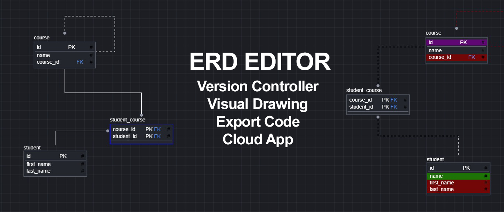

# 🖊️ ERD Editor – Vue.js Project

A **visual Entity-Relationship Diagram (ERD) editor** built with **Vue.js**. Design your database schemas **quickly and interactively**!  

 <!-- می‌توانید مسیر تصویر پروژه را تغییر دهید -->

## ✨ Features
- 🏗️ **Dynamic Diagram Creation:** Add, edit, and delete entities & relationships in real-time.  
- 🎨 **Drag & Drop Interface:** Easily position entities anywhere on the canvas.  
- 📝 **Custom Attributes:** Define entity attributes, primary keys, and foreign keys.  
- 🔄 **Version Control:** Track changes, revert edits, and manage multiple versions of your diagrams.  
- ⚡ **Reactive Vue.js Interface:** Smooth interactions and state management.  

Perfect for developers, database designers, and students who want a **fast and visual way** to design relational databases.  

## 🚀 Quick Install

```bash
# Clone the repository
git clone https://github.com/your-username/erd-editor-vue.git
cd erd-editor-vue

# Install dependencies
npm install

# Run the project
npm run dev
